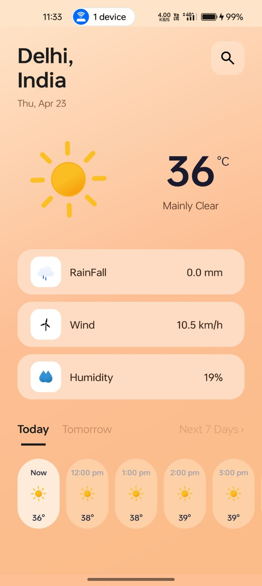
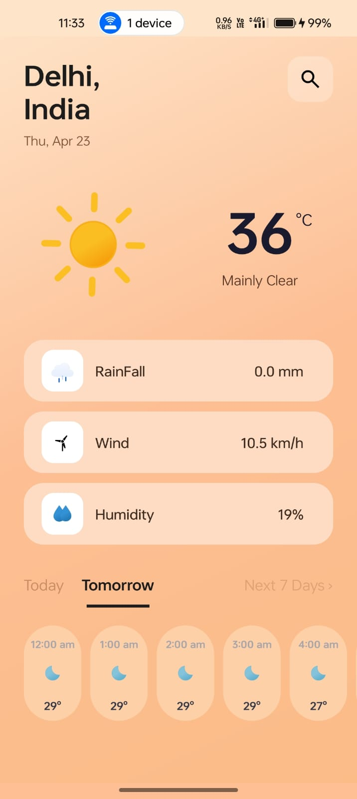
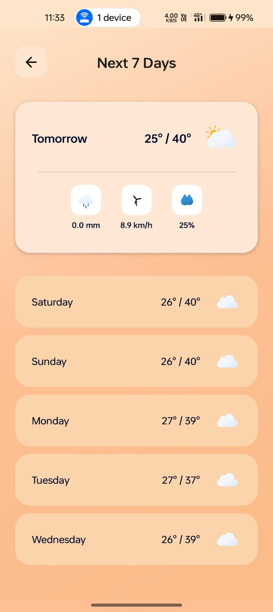
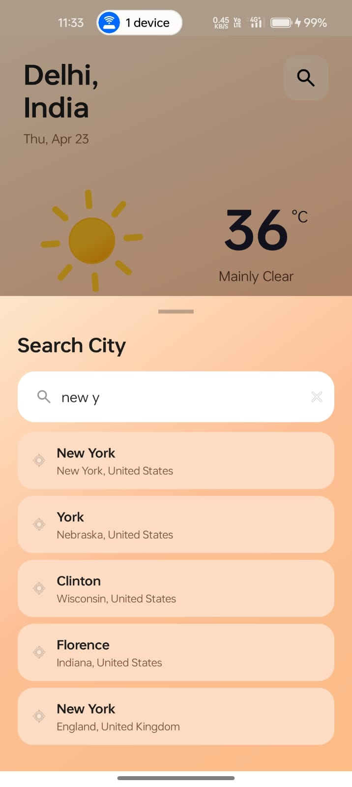

<div align="center">

# 🌤️ WeatherApp

### *Your personal weather companion — beautifully designed for Android*

[](https://android.com)
[](https://kotlinlang.org)
[-orange?style=for-the-badge)](https://developer.android.com)
[](https://developer.android.com/topic/architecture)

<br/>

> *Real-time weather forecast app build with modern ui practices*

<br/>

---

</div>

## 📱 Screenshots

<div align="center">

| Home Screen | Tomorrow's Forecast | 7-Day Weekly View | City Search |
|:-----------:|:-------------------:|:-----------------:|:-----------:|
|  |  |  |  |

</div>

<br/>

---

## ✨ Features

<table>
<tr>
<td width="50%">

### 🌡️ Current Weather
- Real-time temperature display
- Weather condition label (Clear Sky, Rainy, Snowy, etc.)
- Beautiful **Lottie animations** for every weather state
- Day / Night icon switching

</td>
<td width="50%">

### 📍 Smart Location
- **Auto-detects** your current location via GPS
- Instant results using **last known location** cache
- Graceful fallback to network-based location
- Full **reverse geocoding** — shows your actual city name

</td>
</tr>
<tr>
<td width="50%">

### 🔍 City Search
- Search any city worldwide
- Live search with **300ms debounce**
- Powered by **Open-Meteo Geocoding API**
- Clean bottom sheet UI with keyboard auto-open

</td>
<td width="50%">

### 📅 Forecast Views
- **Hourly forecast** — scrollable, starts from current hour
- **Tomorrow's forecast** — detailed featured card
- **7-Day weekly forecast** — full week at a glance
- Precipitation, wind speed & humidity per day

</td>
</tr>
<tr>
<td width="50%">

### 🎨 Polished UI/UX
- Warm peach gradient theme throughout
- **Shimmer skeleton** loading animation
- **Pull-to-refresh** support

</td>
<td width="50%">

### ⚙️ Built Right
- **MVVM architecture** with LiveData
- Parallel API calls with Kotlin **Coroutines**
- Responsive across all screen sizes

</td>
</tr>
</table>

<br/>

---

## 🏗️ Tech Stack

| Category | Technology |
|----------|-----------|
| **Language** | Kotlin |
| **Architecture** | MVVM (Model-View-ViewModel) |
| **Async** | Kotlin Coroutines |
| **Networking** | Retrofit 2 + Gson Converter |
| **UI Components** | Material 3, ConstraintLayout, RecyclerView |
| **Animations** | Lottie by Airbnb |
| **Location** | Google Play Services — FusedLocationProvider |
| **Loading State** | Facebook Shimmer |
| **Weather Data** | [Open-Meteo API](https://open-meteo.com/) *(free, no API key needed)* |
| **Geocoding** | [Open-Meteo Geocoding API](https://geocoding-api.open-meteo.com/) |
| **Reverse Geocoding** | [Nominatim / OpenStreetMap](https://nominatim.openstreetmap.org/) |

<br/>

---

## 🌐 APIs Used

```
📡 Weather Forecast   →  https://api.open-meteo.com/v1/forecast
🔎 City Search        →  https://geocoding-api.open-meteo.com/v1/search
📌 Reverse Geocode    →  https://nominatim.openstreetmap.org/reverse
```

> ✅ **No API keys required** — all APIs used are completely free and open

<br/>

---

## 🗂️ Project Structure

```
app/src/main/java/com/example/weatherapp/
│
├── 📁 adapter/
│   ├── HourlyWeatherAdapter.kt       # Horizontal hourly forecast list
│   ├── SearchResultsAdapter.kt       # City search results list
│   └── WeeklyForecastAdapter.kt      # 7-day forecast list (featured + simple)
│
├── 📁 model/
│   ├── WeatherResponse.kt            # API response data classes
│   ├── GeocodingResponse.kt          # City search response
│   ├── NominatimResponse.kt          # Reverse geocoding response
│   └── WeeklyForecastItem.kt         # Sealed class for weekly list items
│
├── 📁 network/
│   ├── WeatherApiService.kt          # Open-Meteo weather endpoints
│   ├── GeocodingApiService.kt        # City search endpoints
│   ├── NominatimApiService.kt        # Reverse geocoding endpoints
│   └── RetrofitInstance.kt           # Retrofit singleton setup
│
├── 📁 repository/
│   └── WeatherRepository.kt          # Data layer — all API calls
│
├── 📁 viewmodel/
│   └── WeatherViewModel.kt           # UI state, LiveData, coroutines
│
├── MainActivity.kt                   # Main screen
└── WeeklyForecastActivity.kt         # 7-day forecast screen
```

<br/>

---

## 🚀 Getting Started

### Prerequisites
- Android Studio **Hedgehog** or later
- Android device / emulator running **API 28+**

### Installation

```bash
# 1. Clone the repository
git clone https://github.com/YOUR_USERNAME/WeatherApp.git

# 2. Open in Android Studio
# File → Open → select the cloned folder

# 3. Let Gradle sync complete

# 4. Run on your device or emulator
# Click ▶ Run or press Shift+F10
```

> **No setup needed** — no API keys, no config files. Just clone and run. ✅

<br/>

---

## 📦 Dependencies

```kotlin
// Retrofit — Networking
implementation("com.squareup.retrofit2:retrofit:2.9.0")
implementation("com.squareup.retrofit2:converter-gson:2.9.0")

// Lottie — Animations
implementation("com.airbnb.android:lottie:6.1.0")

// Shimmer — Loading skeleton
implementation("com.facebook.shimmer:shimmer:0.5.0")

// Location
implementation("com.google.android.gms:play-services-location:21.0.1")

// Material 3
implementation("com.google.android.material:material:1.11.0")

// SwipeRefreshLayout
implementation("androidx.swiperefreshlayout:swiperefreshlayout:1.1.0")
```

<br/>

---

## 🧠 Architecture Overview

```
┌─────────────────────────────────────────────┐
│                    VIEW                      │
│   MainActivity  ·  WeeklyForecastActivity   │
│   Adapters  ·  XML Layouts  ·  Lottie       │
└──────────────────┬──────────────────────────┘
                   │ observes LiveData
┌──────────────────▼──────────────────────────┐
│               VIEWMODEL                      │
│   WeatherViewModel                          │
│   LiveData  ·  Coroutines  ·  State mgmt   │
└──────────────────┬──────────────────────────┘
                   │ calls suspend functions
┌──────────────────▼──────────────────────────┐
│               REPOSITORY                     │
│   WeatherRepository                         │
│   Parallel API calls  ·  Result<T>          │
└──────────────────┬──────────────────────────┘
                   │ HTTP requests
┌──────────────────▼──────────────────────────┐
│            NETWORK / API LAYER               │
│   Retrofit  ·  Open-Meteo  ·  Nominatim    │
└─────────────────────────────────────────────┘
```

<br/>

---

## 🙋‍♂️ About the Developer

<div align="center">

Built with ❤️ as part of my Android development journey.

*This project demonstrates real-world Android development skills including:*
*MVVM architecture · REST API integration · modern UI design · location services · Kotlin coroutines*

<br/>

[](https://github.com/anup-Kumar2004)
[](https://www.linkedin.com/in/anup-kumar-03b0b1354)

</div>

<br/>

---

<div align="center">

*If you found this project helpful or interesting, please consider giving it a ⭐*

**© 2025 WeatherApp — Built with Kotlin & ☕**

</div>
